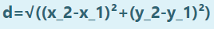

# DISTANCE-BETWEEN-TWO-POINTS

## AIM:
To write a python program to find the distance two 2 points
## ALGORITHM:
### Step 1: 
Import the package math.
### Step 2: 
Initialize the x and y co-ordinates of two points.
### Step 3: 
Substitute the values in the distance formula  
### Step 4: 
Round the calculated value with two decimal points.
### Step 5: 
Print the distance between the two given points.
### PROGRAM:
 ```
 #Program to find the distance between two points.
#Developed by: Sethukkarasi C
#RegisterNumber:23012881
import math
x1,y1,x2,y2=4,2,10,6
d=math.sqrt((x2-x1)**2+(y2-y1)**2)
D=round(d,2)
print(D)
``` 


### OUTPUT:


### RESULT:
Thus the distance between two points is calculated and executed successfully.